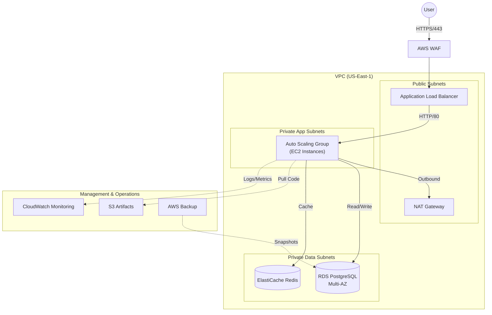

# High-Availability Three-Tier Web Application on AWS


A production-grade, highly available, and secure three-tier web application architecture deployed on AWS. This project demonstrates advanced Cloud Engineering practices including **Infrastructure as Code (IaC)**, **CI/CD pipelines**, **Network Segmentation**, and **Automated Disaster Recovery**.

---

## Architecture Overview

The infrastructure is built using a Hub-and-Spoke model (simulated) with strict network isolation.



## Key Features

- **High Availability & Fault Tolerance**:
  - Multi-AZ deployment for all tiers (Web, App, Data).
  - Auto Scaling Group (ASG) capable of handling traffic spikes and self-healing.
  - RDS Multi-AZ for seamless database failover.

- **Security First Design**:
  - **Network Isolation**: Strict separation of public (DMZ) and private subnets.
  - **WAF Protection**: AWS WAF rules to block common web exploits (SQLi, XSS).
  - **Least Privilege**: Granular IAM roles for EC2, Lambda, and CI/CD runners.
  - **Encryption**: Data encrypted at rest (KMS) and in transit (TLS 1.2+).

- **DevOps & Automation**:
  - **Infrastructure as Code**: 100% Terraform managed with modular design.
  - **CI/CD Pipelines**: GitHub Actions for automated Terraform validation (`tfsec`, `tflint`) and application deployment.
  - **Zero-Downtime Deployment**: Rolling updates via Instance Refresh.

- **Observability**:
  - Centralized CloudWatch Dashboards for ALB, EC2, and RDS metrics.
  - SNS Alerts for critical thresholds (CPU > 80%, 5xx Errors).

## 🛠️ Technology Stack

| Layer              | Technology                                          |
| ------------------ | --------------------------------------------------- |
| **Cloud Provider** | AWS (VPC, EC2, RDS, ElastiCache, ALB, S3, IAM, WAF) |
| **IaC**            | Terraform (Modular, Remote State S3+DynamoDB)       |
| **CI/CD**          | GitHub Actions (OIDC Authentication)                |
| **Frontend**       | React (Vite, Single Page Application)               |
| **Backend**        | Python Flask (REST API, Gunicorn)                   |
| **Database**       | PostgreSQL 15 (AWS RDS)                             |
| **Caching**        | Redis 7 (AWS ElastiCache)                           |
| **Server**         | Nginx (Reverse Proxy)                               |

## 📂 Project Structure

```bash
├── .github/workflows/    # CI/CD Pipelines (Terraform Plan/Apply, Security Scan)
├── application/          # Source code
│   ├── frontend/         # React SPA
│   └── backend/          # Flask API
├── docs/                 # Detailed Documentation & Runbooks
├── environments/         # Environment Configs (Dev, Staging, Prod)
├── modules/              # Reusable Terraform Modules (VPC, ASG, RDS, etc.)
└── scripts/              # Automation Scripts (Deploy, Rollback, Cost Report)
```

## Quick Start Guide

### Prerequisites

- AWS Account (Admin Access)
- Terraform v1.6+
- AWS CLI v2
- Git

### 1. Bootstrap Infrastructure

Initialize remote state storage (S3 + DynamoDB).

```bash
cd environments/bootstrap
terraform init && terraform apply
```

### 2. Deploy Development Environment

Provision the VPC, Databases, and Compute resources.

```bash
cd ../dev
terraform init && terraform apply
```

### 3. Deploy Application

Build React app, package with Flask, upload to S3, and trigger rolling update.

```bash
# Get the S3 bucket name created by Terraform
BUCKET=$(cd environments/dev && terraform output -raw s3_static_assets_bucket)

# Run the deployment script
./scripts/deploy.sh application dev
```

### 4. Access the Application

Get the Load Balancer DNS name:

```bash
cd environments/dev && terraform output alb_dns_name
```

Open the URL in your browser to see the live application.

## 📚 Documentation

Detailed documentation for review and operations:

- **[Architecture Decisions (ADR)](docs/architecture/ADR.md)**: Why we chose strict network isolation and Terraform.
- **[Infrastructure Inventory](docs/architecture/infrastructure-inventory.md)**: Breakdown of resources and estimated costs.
- **[Disaster Recovery Runbooks](docs/operations/runbooks/dr-runbooks.md)**: Procedures for restoring RDS and EC2.
- **[Deployment Guide](docs/operations/runbooks/app-deployment.md)**: Step-by-step application deployment workflow.
- **[Well-Architected Review](docs/well-architected/review.md)**: Self-assessment against AWS best practices.

## 👨‍💻 Author

**Edokwe**
_Cloud Engineer | DevOps Enthusiast_

---

_Built for the [Cloud Engineering Portfolio](https://github.com/Edokwe)._
