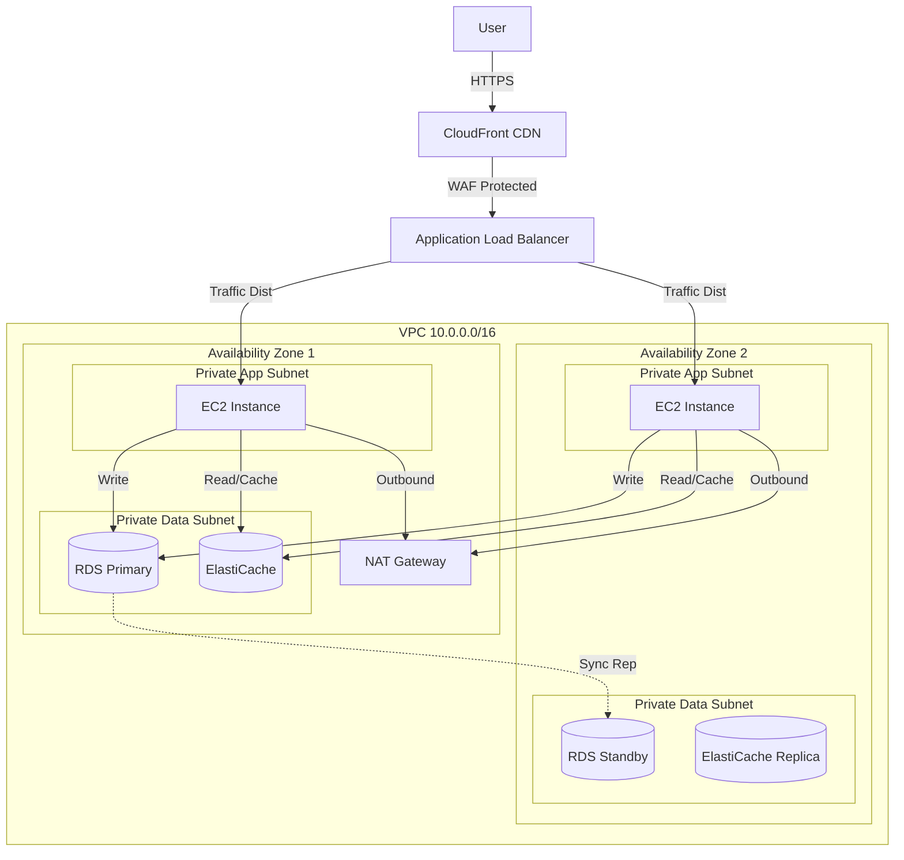

# AWS High-Availability Three-Tier Web Application


## 📋 Project Overview

This project demonstrates a **production-grade, high-availability web infrastructure** on AWS, built using **Infrastructure as Code (IaC)** principles. designed to host a scalable web application (Python Flask/Node.js). It showcases advanced cloud architectural patterns including multi-AZ resilience, auto-scaling, defense-in-depth security, and performance caching.

**Goal:** To build a robust, fault-tolerant platform capable of handling variable traffic loads while maintaining strict security and keeping costs predictable.

## 🏗 Architecture

The infrastructure follows a classic **Three-Tier Architecture** (Presentation, Logic, Data) spread across **two Availability Zones (AZs)** for high availability.



### Key Components

| Component      | Service               | Role                                                                                   |
| -------------- | --------------------- | -------------------------------------------------------------------------------------- |
| **Compute**    | EC2 + Auto Scaling    | Handles application logic; scales from 2-4 instances based on CPU load.                |
| **Networking** | VPC, NAT Gateway      | Provides network isolation; Private subnets for logic/data, Public for load balancing. |
| **Database**   | RDS PostgreSQL        | Multi-AZ relational database with automated failover.                                  |
| **Caching**    | ElastiCache Redis     | In-memory caching for session management and database query offloading.                |
| **Delivery**   | CloudFront + ALB      | Global content delivery network and intelligent layer 7 load balancing.                |
| **Security**   | WAF + Security Groups | Web Application Firewall for exploit protection; granular firewall rules.              |
| **Monitoring** | CloudWatch            | Centralized logging, metrics, and alarm-based scaling policies.                        |

## 🛠️ Technology Stack

- **Infrastructure as Code**: Terraform (Modular design)
- **Cloud Provider**: AWS (us-east-1)
- **CI/CD**: GitHub Actions (planned)
- **Application**: Python Flask / Node.js
- **Scripting**: Bash (User Data configuration)

## 📂 Repository Structure

```
├── documentation/          # Detailed Architecture Decisions & Diagrams
│   ├── architecture.md
│   ├── network-design.md
│   ├── security.md
│   └── monitoring.md
├── terraform/              # Infrastructure Code
│   ├── environments/       # State separation (Dev, Staging, Prod)
│   │   └── dev/
│   └── modules/            # Reusable Terraform Modules
│       └── vpc/
└── README.md
```

## 🚀 Key Features Demonstrated

1.  **High Availability (HA)**: The system can survive the total loss of a data center (Availability Zone) with no manual intervention, thanks to Multi-AZ RDS and Auto Scaling.
2.  **Scalability**: The application tier automatically scales out during traffic spikes and scales in during quiet periods to save costs.
3.  **Security in Depth**:
    - **Network Isolation**: No application or database server has a public IP.
    - **Encryption**: Data encrypted at rest (KMS) and in transit (TLS).
    - **Least Privilege**: IAM roles restrict permissions for EC2 instances.
4.  **Performance Optimization**:
    - **CloudFront**: Caches static assets at the edge.
    - **Redis**: Microsecond latency for session data retrieval.
5.  **Cost Efficiency**: Use of burstable instances (t3 series) and strategic NAT placement for non-prod environments.

## 💻 Getting Started

### Prerequisites

- AWS CLI configured with appropriate permissions.
- Terraform installed (v1.0+).

### Deployment Steps

1.  **Clone the Repository**

    ```bash
    git clone https://github.com/yourusername/high-availability-webapp.git
    cd high-availability-webapp
    ```

2.  **Initialize Terraform**
    Navigate to the environment directory:

    ```bash
    cd terraform/environments/dev
    terraform init
    ```

3.  **Plan & Apply**

    ```bash
    terraform plan -out=tfplan
    terraform apply tfplan
    ```

4.  **Verify**
    Terraform will output the Load Balancer DNS name. Access it via your browser to see the running application.

## 💰 Resource Estimation

- **Production Tier**: ~$150-200/month (Multi-AZ RDS, 2 NAT Gateways, ALB).
- **Demo/Dev Tier**: ~$50/month (Single-AZ RDS, 1 NAT Gateway, Spot Instances).
- _Note: This repository defaults to the Cost-Optimized Dev configuration._

## 📜 License

Distributed under the MIT License. See `LICENSE` for more information.

---

_Architected and Built for AWS Cloud Proficiency Portfolio._
