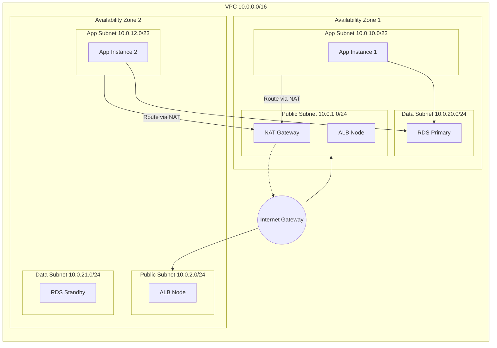

# Network Design & VPC Foundation

This document details the network infrastructure for our high-availability three-tier web application, designed for secure deployment within a Virtual Private Cloud (VPC) on AWS. This design prioritizes isolation and fault tolerance.

## VPC Specifications

- **VPC Name**: `production-vpc`
- **CIDR Block**: `10.0.0.0/16`
- **Region**: `us-east-1` (chosen for demonstration and cost effectiveness)
- **Availability Zones**: `us-east-1a` (AZ 1, also primary) and `us-east-1b` (AZ 2, also secondary)

## Subnet Layout (Across 2 AZs)

### 1. Public Subnets (Public Tier)

These subnets are directly accessible from the internet. They host:

- NAT Gateway (for outbound connectivity from private subnets).
- Application Load Balancer (ALB).
- Bastion Host (Optional, if SSH access is strictly required).

- **AZ 1**: `10.0.1.0/24` (Public Subnet A)
- **AZ 2**: `10.0.2.0/24` (Public Subnet B)
- **Total IPs per subnet**: 251 usable (256 - 5 AWS reserved)

### 2. Private Subnets (Application Tier)

These subnets host the web/application servers within an Auto Scaling Group. No direct internet access; outbound traffic routes through the NAT Gateway.

- **AZ 1**: `10.0.10.0/23` (Private Subnet App A)
- **AZ 2**: `10.0.12.0/23` (Private Subnet App B)
- **Total IPs per subnet**: 506 usable (512 - 5 AWS reserved) - Larger range (`/23`) to support scaling.

### 3. Data Subnets (Database Tier)

Dedicated subnets for RDS and ElastiCache instances. Strictly private; no internet access.

- **AZ 1**: `10.0.20.0/24` (Data Subnet A)
- **AZ 2**: `10.0.21.0/24` (Data Subnet B)

## Routing Configuration

### Internet Gateway (IGW)

- Attached to the VPC to enable internet connectivity for the Public Subnets.

### NAT Gateway

- Deployed in **Public Subnet A** (AZ 1).
- Provides outbound internet access for instances in the private subnets (e.g., software updates).
- **Cost Note**: For production cost optimization, a single NAT Gateway is used. High Availability (HA) would require a NAT Gateway in each AZ.

### Route Tables

| Route Table Name            | Associated Subnets                         | Destination | Target                         |
| :-------------------------- | :----------------------------------------- | :---------- | :----------------------------- |
| **Public-Route-Table**      | Public Subnet A, Public Subnet B           | `0.0.0.0/0` | `igw-xxxxx` (Internet Gateway) |
| **Private-App-Route-Table** | Private App Subnet A, Private App Subnet B | `0.0.0.0/0` | `nat-xxxxx` (NAT Gateway)      |
| **Data-Route-Table**        | Data Subnet A, Data Subnet B               | `Local`     | `Local` (Internal only)        |

## Security Groups Strategy

Network access control is enforced at the instance level using Security Groups.

1.  **ALB-SG (Load Balancer)**:
    - **Inbound**: HTTP (80) / HTTPS (443) from `0.0.0.0/0` (Anywhere)
    - **Outbound**: HTTP (80) to App-SG

2.  **App-SG (Web Tier)**:
    - **Inbound**: HTTP (80) from `ALB-SG` ONLY
    - **Outbound**:
      - MySQL/PostgreSQL (3306/5432) to Data-SG
      - HTTPS (443) to `0.0.0.0/0` (for updates/API calls via NAT)

3.  **Data-SG (Database Tier)**:
    - **Inbound**: MySQL/PostgreSQL from `App-SG` ONLY
    - **Outbound**: None (or strictly limited internal traffic)

## Diagram: Subnet Architecture

