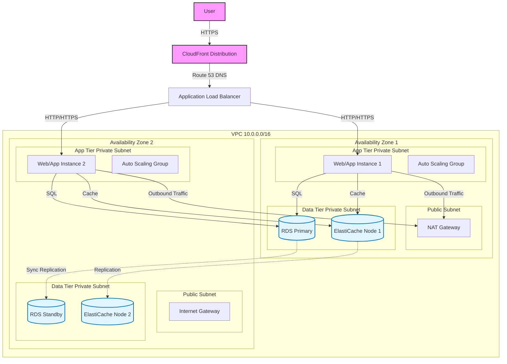

# High-Level Architecture Overview

This document outlines the high-level architecture for a scalable, high-availability three-tier web application deployed on AWS. The design prioritizes reliability, security, and cost-effectiveness while adhering to best practices.

## Architecture Diagram

The following diagram illustrates the component interaction across three tiers (Web, Application, Data) spanning two Availability Zones.

## Key Components

### 1. Entry Points

- **Route 53**: Managed DNS service to route user requests.
- **CloudFront**: Content Delivery Network (CDN) to cache static content at the edge, reducing latency and load on the backend.
- **Application Load Balancer (ALB)**: Distributes incoming application traffic across multiple targets (EC2 instances) in multiple Availability Zones.

### 2. Compute (Application Tier)

- **EC2 Instances**: Virtual servers running the application.
- **Auto Scaling Group**: Automatically adjusts the number of EC2 instances to match the load, ensuring performance and minimizing costs.
- **Private Subnets**: Instances are placed in private subnets, not directly accessible from the internet, improving security.

### 3. Data Tier

- **Amazon RDS (Multi-AZ)**: Relational Database Service configured with a standby replica in a different AZ for automatic failover and high availability.
- **Amazon ElastiCache (Redis)**: In-memory data store for caching session data and frequently accessed query results to improve application performance.
- **Private Subnets**: Databases are isolated in their own private subnets.

### 4. Networking & Security

- **VPC**: Logically isolated virtual network.
- **NAT Gateway**: Allows instances in private subnets to connect to the internet (e.g., for updates) but prevents the internet from initiating connections with those instances.
- **Security Groups**: Virtual firewalls that control inbound and outbound traffic at the instance level.
- **WAF (Web Application Firewall)**: Protects the application from common web exploits (can be attached to CloudFront or ALB).

## Data Flow

1.  **User Request**: Traffic enters via CloudFront/Route 53.
2.  **Load Balancing**: The ALB receives the request and distributes it to a healthy EC2 instance in the App Tier.
3.  **Application Logic**: The EC2 instance processes the request.
    - **Read/Write**: If data storage is needed, it connects to the primary RDS instance.
    - **Caching**: It checks ElastiCache for cached data before querying the database.
4.  **Response**: The response is sent back through the ALB and CloudFront to the user.
